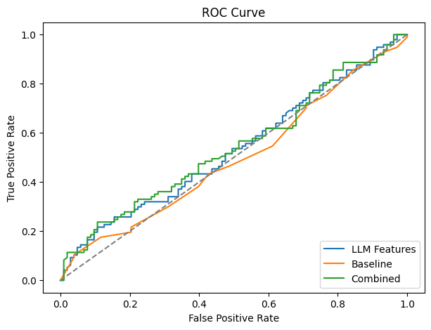
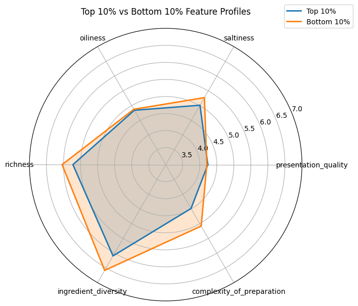
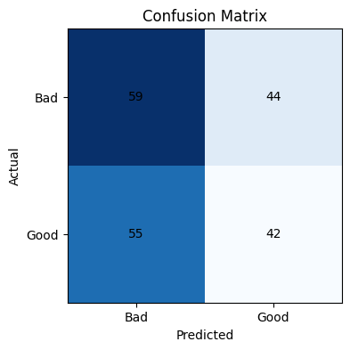

CS 568 Group 14 Project: Designing the Perfect Dish
===================================================

**Team Members:** Noah Antisseril, Ethan Cai, Mohi, Anirudha Kyathsandra, Muchen Xu

**NetIDs:** noahsa2, epcai2, mohi2, akyath2, muchenx2

1\. Introduction: The Design Problem
------------------------------------

Cooking is fundamentally a design process. Every recipe is a blueprint aiming to optimize human sensory experience. However, when trying to understand what makes a dish "good," traditional data analysis falls short because recipes are usually stored as unstructured text (ingredients and steps).

Our project addresses a real-world design problem: **How can we quantitatively determine which qualitative features (e.g., presentation, oiliness, complexity) are the most critical when designing a highly-rated recipe?** By answering this, we can formulate data-driven "design rules" to improve and modernize existing recipes.

2\. Methodology
---------------

To bridge the gap between unstructured text and quantifiable design traits, we implemented a two-phase data-driven approach:

### Phase 1: LLM Data Augmentation (Feature Engineering)

We utilized a Large Language Model (Google's Gemma 3 27B) as a "virtual culinary evaluator." Instead of relying on surface-level text data, we passed the raw ingredients and cooking steps of each recipe into the LLM. We prompted it to act as an objective judge, scoring each recipe on a strict, absolute scale (1.0 to 10.0) across six qualitative dimensions:

1.  presentation\_quality
    
2.  saltiness
    
3.  oiliness
    
4.  richness
    
5.  ingredient\_diversity
    
6.  complexity\_of\_preparation
    

### Phase 2: Statistical Modeling and Analysis

We modeled the relationship between these LLM-generated features and the actual real-world user ratings.

*   **The Target Variable (y):** We calculated the mean user rating for each recipe. To handle the natural skewness of internet reviews (where most people simply leave 4 or 5 stars), we binarized the target using a **median split**. Recipes above the median were labeled as "High-Rated" (1), and those below or equal were "Low-Rated" (0). This prevents the model from cheating by simply predicting a high average score for everything.
    
*   **The Features (X):** We standardized the 6 LLM features. We also calculated **Baseline Features** (the raw length of the recipe steps and the count of ingredients) to serve as our control group.
    
*   **The Models:** We utilized Logistic Regression to extract linear correlation coefficients (feature importances) to understand _why_ a recipe succeeds. For a robust evaluation of predictive power, we used Random Forest classification to compare our LLM Features against the Baseline.
    

3\. Experiment Setup
--------------------

*   **Dataset:** We utilized the publicly available _Food.com Recipes and User Interactions_ dataset from Kaggle.
    
*   **Sampling & Denoising:** We randomly sampled **1,000 recipes**. To ensure a high signal-to-noise ratio, we applied strict data-cleaning filters: we removed unreliable users (users who gave the exact same rating to every dish) and dropped any recipe with fewer than 5 total reviews to ensure our target ratings were statistically significant.
    

4\. Results & Interpretation
----------------------------

### 4.1 Model Performance: Did it work?

We compared the predictive power of our LLM sensory features against the traditional Baseline features.

*   **Baseline Features:** Accuracy = 0.587, ROC-AUC = 0.609
    
*   **LLM Features:** Accuracy = 0.630, ROC-AUC = 0.662
    

**Interpreting Accuracy and ROC-AUC:** In a binary classification task perfectly split down the middle (50/50), an Accuracy of 0.50 is equivalent to a coin flip. Our LLM features achieved 63.0% accuracy, significantly outperforming the baseline.

More importantly, we look at **ROC-AUC (Area Under the Receiver Operating Characteristic Curve)**. Simply put, ROC-AUC measures the model's _ranking ability_. An AUC of 0.662 means that if you randomly pick one truly "Good" recipe and one truly "Bad" recipe, our model has a 66.2% chance of correctly ranking the good one higher.

**Visualizing the ROC Curve:** The chart above plots the True Positive Rate against the False Positive Rate. The grey dashed diagonal represents a useless model that simply guesses randomly (AUC = 0.5).

*   The **orange Baseline curve** barely lifts above this random-guess threshold, indicating that basic structural properties (like recipe length and ingredient count) are poor predictors of human preference.
    
*   The **blue LLM Features curve**, however, bows significantly closer to the top-left corner. This visible gap between the blue and orange lines mathematically represents the added predictive power of our "virtual culinary evaluator."
    

**What this implies:** Human taste is notoriously subjective, noisy, and difficult to predict. The visual lift in the ROC curve proves the effectiveness of our approach. We successfully captured real statistical signals from human taste preferences—showing that qualitative sensory design features are vastly superior to quantitative text metrics when evaluating food.

### 4.2 Feature Importances: The Design Rules of Cooking

Using our Logistic Regression model, we extracted the coefficients (weights) for each feature. A positive coefficient means the feature increases the likelihood of a high rating; a negative coefficient means it hurts the rating.

| **Feature** | **Coefficient (Weight)** |
|-----------------|-------------------------|
| complexity\_of\_preparation | **\-0.160115** |
| saltiness | **\-0.151902** |
| richness | **\-0.136621** |
| presentation\_quality | **+0.135311** |
| oiliness | **+0.133328** |
| ingredient\_diversity | -0.076834 |

These numbers allow us to establish **Three Core Design Rules** for modern recipe creation:

1.  **The Enemy is Friction (complexity: -0.160):** This is the strongest negative factor. Diners (and home cooks) heavily penalize recipes that require tedious, multi-step monitoring. A good design must optimize for efficiency.
    
2.  **Lighten the Load (saltiness: -0.152, richness: -0.137):** Modern palates reject extreme sodium and overly heavy, decadent profiles (like excessive cream or cheese). Recipes must be designed to be lighter and fresher.
    
3.  **Visuals and Comfort (presentation: +0.135, oiliness: +0.133):** "We eat with our eyes first." High presentation quality provides a massive boost to ratings. Interestingly, while "richness" is penalized, a moderate amount of "oiliness" (healthy fats) is rewarded, as it provides the necessary mouthfeel for comfort food.
    

### 4.3 Visualizing the Findings: The Feature Radar

To visually confirm our statistical "Design Rules," we mapped out the "genetic profiles" of the highest and lowest-rated recipes in our dataset.

_(Note: The radar axes are focused between 2.0 and 6.0 to better highlight the statistical shape of variance, as the LLM was prompted using strict absolute anchors that naturally center average home cooking around a 5.0)._

By comparing the average LLM scores of the Top 10% highest-rated dishes against the Bottom 10% lowest-rated dishes, a clear pattern emerges:

*   **The Spike in Presentation:** The most distinct difference is the sharp outward spike in presentation\_quality for the Top 10% recipes. Visual appeal acts as a major differentiator for success.
    
*   **The Contraction in Complexity and Saltiness:** Conversely, the blue shape (Top 10%) distinctly pulls inward on the complexity\_of\_preparation and saltiness axes compared to the bottom-tier recipes.
    

This visualization effectively summarizes our findings: the ideal recipe is one that looks spectacular, requires minimal friction to prepare, and completely avoids heavy sodium.

### 4.4 The Reality Check: Confusion Matrix

To maintain academic rigor, we must also examine where our model falls short. The Confusion Matrix below maps our model's predictions against actual human ratings on our test set.

**How to read this chart:** \* The **darker diagonal cells** represent correct predictions (e.g., the model predicted a recipe would be highly rated, and it actually was).

*   The **lighter off-diagonal cells** represent errors—instances where our model confidently predicted a certain outcome, but the actual diners disagreed.

**Why it matters:** This chart honestly visualizes the boundaries of quantitative design in a highly subjective domain. Why does the model make mistakes? Because the ultimate evaluator is a human being. A recipe might perfectly adhere to our "Design Rules"—featuring low salt, low complexity, and a beautiful presentation—but a specific diner might still give it a 1-star rating simply because they personally dislike a specific ingredient or had a bad day.

The confusion matrix proves that while we can use data to optimize the underlying _logic_ and _probability of success_ for a recipe, we can never completely engineer away the subjective bias of human taste.

5\. Applying the Data: The Recipe Optimizer Demo
------------------------------------------------

To prove that our data-driven approach solves a real design problem, we built a generative AI "Recipe Optimizer." We took an adversarial baseline recipe—a heavy, tedious, high-sodium casserole—and instructed the LLM to redesign it strictly following our new Design Rules (reducing complexity via modern appliances, cutting salt/richness, and boosting presentation).

### 1. THE BASELINE RECIPE

*   **Name:** Heavy Salted Cheese & Cream Casserole Mash
    
*   **Ingredients:** 3 cups heavy cream, 2 cups processed cheese, 1 cup butter, 4 tbsp salt, 2 lbs ground beef, canned potatoes.
    
*   **Steps:** Dump everything into a slow cooker. Cook for 8 hours until it becomes a homogenous grey sludge. Add extra salt to taste. Serve in a large messy bowl.
    

### 2. THE OPTIMIZED RECIPE (Air Fryer/Pressure Cooker Modernization)

*   **Name:** Savory Beef & Potato Mash with Herbs
    
*   **Ingredients:** 2 lbs lean ground beef, 2 lbs Yukon Gold potatoes, 1 cup low-sodium beef broth, 1/2 cup Greek yogurt, 2 tbsp olive oil, fresh rosemary, black pepper, garlic powder.
    
*   **Steps:** Brown beef in olive oil. Boil potatoes in low-sodium broth for 15-20 mins. Mash together with Greek yogurt and spices. **To plate:** Spoon mash into shallow bowls, drizzle with olive oil, and garnish with fresh rosemary.
    

### 3. THE RESULTS: FEATURE SHIFT & PREDICTION

When we passed both recipes back through our evaluation pipeline, the data proved the success of the redesign:

*   **Presentation** skyrocketed (1.5 → 5.5).
    
*   **Saltiness** and **Richness** plummeted to acceptable levels (9.0 → 3.0, and 10.0 → 6.0).
    
*   **Complexity**, despite moving from a "dump-and-forget" slow cooker to active cooking, landed at a reasonable 5.0.
    

**The Final Prediction:**

*   Baseline Win Probability: **27.7%**
    
*   Optimized Win Probability: **56.5%**
    

By analyzing data, we successfully transformed a mathematically "doomed" recipe (27.7% chance of success) into a highly favorable, modern dish (56.5%) that crosses the median threshold. This demonstrates the power of using LLM-augmented data analysis to drive real-world design decisions.